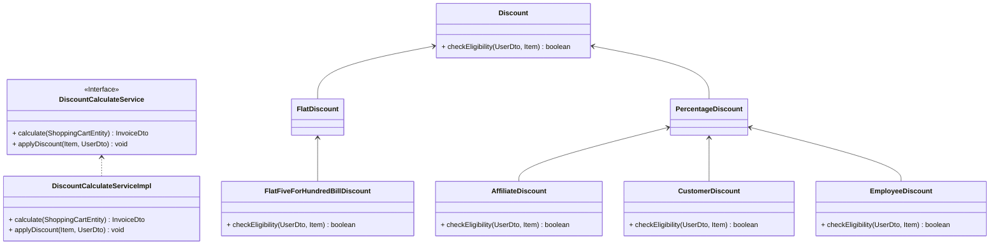

[](https://github.com/sachith89/CurrencyDiscountCalculator/actions/workflows/maven.yml)
# 💱 Currency Exchange and Discount Calculation API

## 📝 Project Description
This Spring Boot application integrates with a third-party currency exchange API to retrieve real-time exchange rates. It calculates the total payable amount for a bill in a specified currency after applying applicable discounts. The project demonstrates object-oriented design, authentication, testing, and modern coding practices.

---

## 📦 Features
- Real-time currency conversion using third-party APIs.
- Discounts based on user type and tenure.
- Supports flat discounts on bills over $100.
- Authentication for secure endpoints.

---

## 🏗️ Tech Stack
- Java 23 with Spring Boot. 3.4.3
- Maven.
- JUnit5 and Mockito for testing.
- SonarQube for code quality.
- External Currency Exchange API (e.g., ExchangeRate-API or Open Exchange Rates).

---



---

## ⚙️ Setup Instructions
1. **Clone the Repository:**
```bash
git clone https://github.com/sachith89/CurrencyDiscountCalculator.git
cd CurrencyDiscountCalculator
```
2. **Configure API Key:**
    - Add your API key in `application.properties`:
```properties
currency.api.url=https://open.er-api.com/v6/latest/
currency.api.key=your-api-key
```
3. **Build and Run:**
```bash
./mvnw clean install
./mvnw spring-boot:run
```
4. **Access the API:**
    - Base URL: `http://localhost:8080`

---

## 📤 API Endpoints
### 🧾 Calculate Payable Amount
**Endpoint:** `POST /api/calculate`

**Request Body:**
```json
{
  "items": [
    {"name": "item1", "category": "grocery", "price": 50},
    {"name": "item2", "category": "electronics", "price": 150}
  ],
  "userType": "employee",  
  "customerTenure": 3,  
  "originalCurrency": "USD",
  "targetCurrency": "EUR"
}
```

**Response:**
```json
{
  "payableAmount": 120.50,
  "currency": "EUR"
}
```

---

## 🧪 Testing
1. **Run Unit Tests:**
```bash
./mvnw test
```
2. **Generate Coverage Reports:**
```bash
./mvnw jacoco:report
```

---

## 📈 Code Quality
1. **Run SonarQube:**
```bash
./mvnw sonar:sonar
```

---

## ⚙️ Build Automation
- Run build and tests with:
```bash
./mvnw clean install
```
- Generate reports and analyze code quality:
```bash
./mvnw verify
```

---

## 📌 Assumptions
- Only one percentage-based discount applies per bill.
- Percentage-based discounts do not apply to groceries.
- A $5 flat discount applies per $100 on the bill.